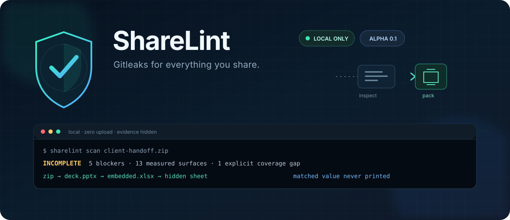

<div align="center">
  
</div>

<p align="center">
  <strong>为你分享的一切而生的 Gitleaks。</strong><br>
  文件、目录或压缩包离开电脑前，在本地检查完整的交付边界。
</p>

<p align="center">
  <a href="#快速开始">快速开始</a> ·
  <a href="#检查范围">检查范围</a> ·
  <a href="docs/threat-model.md">威胁模型</a> ·
  <a href="README.md">English</a>
</p>

> [!IMPORTANT]
> **Alpha 软件。** ShareLint 已有可运行、零第三方运行时依赖的核心，但规则和格式覆盖仍在扩展。
> 有可用的带标签软件包时请优先使用，否则可从源码安装；无论哪种方式，都应独立复核重要结果。

你正准备发送一个 ZIP：代码没有问题，但演示文稿还留着演讲者备注，工作簿里藏着
`veryHidden` 工作表，PDF 暴露了作者姓名，图片则记录了位置。专注 Git 仓库的密钥扫描器
看不到这个完整边界，ShareLint 可以。

它会沿嵌套容器保留发现项的完整来源链，在所有报告中隐藏匹配原文，并明确说明哪些表面只完成了
部分检查。`pack` 只有在配置的策略与覆盖检查全部通过后才会生成确定性 ZIP，随后重新打开并扫描
输出文件。

## 为什么还需要 ShareLint

多数工具只检查交付物的一层。ShareLint 把所选文件、目录和每个受支持的嵌套容器视为同一个披露边界：

| 方法 | 擅长 | ShareLint 补充的能力 |
| --- | --- | --- |
| 代码仓库密钥扫描 | 源码与历史记录中的凭证 | Office/PDF/图片表面、文件名和嵌套交付包 |
| 元数据检查或清理 | 单一格式的特定字段 | 跨格式来源链、内容规则和明确的覆盖台账 |
| 托管式 DLP | 组织级策略和受管渠道 | 无需服务或账号、零上传的个人预检 |
| 人工检查 ZIP | 人类语境判断 | 可复现限额、掩码证据、输出复扫和哈希绑定回执 |

它适合与这些控制手段组合使用，并不试图取代所有工具。

## 快速开始

ShareLint 需要 Python 3.11 或更高版本。源码检出无需任何第三方运行时依赖：

```bash
git clone https://github.com/jasonzhang25-ship-it/sharelint.git
cd sharelint
python -m pip install -e .
sharelint demo
```

带标签的软件包发布后，可使用等价的一行安装命令：

```bash
python -m pip install sharelint
```

演示命令会在临时目录创建一个完全由合成数据组成、用完即弃的交付包。它会展示嵌套 Office 内容、
PDF 元数据、主动内容、脱敏证据，以及一个明确的 PDF 覆盖缺口，不会操作你的文件。以下为节选输出：

```text
ShareLint 0.1.0 · local privacy preflight
INCOMPLETE · 5 policy-blocking finding(s) · 9 total · 13 surface(s)
Coverage · 12 scanned · 1 partial · 0 skipped · 0 error(s)

CRITICAL SL.SECRET.AWS_ACCESS_KEY · AWS access key identifier
         client-handoff.zip -> deck.pptx -> ppt/embeddings/clients.xlsx
         evidence <secret:20 chars> [report-scoped fingerprint]

Coverage gaps
  PARTIAL client-handoff.zip -> report.pdf · rendered-page OCR is not enabled

Original untouched · 0 bytes uploaded · matched values hidden
A pass means no configured blocker was found on the listed surfaces; it is not a safety guarantee.
```

## 使用方法

扫描文件、目录、ZIP 或 Office 文档：

```bash
sharelint scan ./client-handoff
```

输出机器可读报告或静态 HTML 审阅页：

```bash
sharelint scan ./client-handoff --format json  -o sharelint.json
sharelint scan ./client-handoff --format sarif -o sharelint.sarif
sharelint scan ./client-handoff --format html  -o sharelint.html
```

平台支持时，报告文件仅限当前用户读取；输出不会覆盖既有路径，也不能写入正在扫描的目录。
`demo -o` 同样遵循不可覆盖规则。

在自动化流程中，让普通扫描也因覆盖缺口失败：

```bash
sharelint scan ./client-handoff --strict --fail-on high
```

仅在严格门禁通过时创建待分享文件包：

```bash
sharelint pack ./approved-files -o release.zip
```

成功后会写出 `release.zip`、最小化回执 `release.zip.sharelint.json`，以及与回执精确绑定的伴随报告
`release.zip.sharelint.report.json`。回执绑定输出哈希、策略、实测覆盖和伴随报告哈希摘要。失败时不会发布
压缩包。显式指定 `--receipt blocked.json` 可为失败尝试写出 `blocked.json` 和
`blocked.report.json`；它绝不是成功回执。伴随报告包含已掩码的发现项及上下文文件名，即使匹配原文
保持隐藏，也应作为敏感记录妥善保护。成功回执还会列出压缩包成员路径，应与压缩包一同妥善保护。

`pack` 始终拒绝任何 `partial`、`skipped` 或报错的覆盖结果，并且刻意不提供绕过开关：只有所有必需
表面都完成检查时，打包回执才有意义。

从当前检出版本查看真实规则集：

```bash
sharelint rules
sharelint explain SL.OFFICE.NOTES
```

### 退出码

| 代码 | 含义 |
| ---: | --- |
| `0` | 命令已完成，所选门禁没有阻止操作。 |
| `1` | 发现项达到阈值、严格覆盖失败，或 `pack` 被阻止。 |
| `2` | 参数无效、输入不可读，或发生其他运行错误。 |

`sharelint demo` 在展示完合成的被阻止案例后会有意返回 `0`。

## 检查范围

| 表面 | 当前检查内容 | 覆盖语义 |
| --- | --- | --- |
| 目录 | 稳定顺序递归遍历、路径/名称检查、普通文件 | 不跟随符号链接；跳过或不支持的条目仍会显示。 |
| ZIP 压缩包 | 有界内存检查、压缩包/条目注释、扩展字段、嵌套压缩包、路径穿越、链接、加密、重复项、压缩炸弹限制 | 绝不将成员解压到磁盘；超限、不可读成员或未知扩展字段类型会成为覆盖缺口。 |
| Office Open XML | DOCX/XLSX/PPTX 属性、批注、修订、隐藏文本/工作表/幻灯片、备注、外部关系、宏、自定义 XML、预览、嵌入对象 | OOXML 使用相同的压缩包限制；嵌入包保留完整来源链。 |
| PDF | 静态元数据、主动内容标记、附件、加密和增量历史 | **覆盖不完整：**不对渲染页面做 OCR，也不会启动查看器。 |
| 图片 | JPEG/PNG/WebP/TIFF 元数据，包括受支持的身份、设备、文本和 GPS 字段 | **覆盖不完整：**不对像素做 OCR；“已扫描元数据”不等于“已扫描图片内容”。 |
| 文本 | 常见凭证、私钥标记、邮箱、美国 SSN、支付卡号和暴露身份的本地路径 | 基于模式的检测可能误报，也可能漏报。 |

请运行 `sharelint rules` 查看当前安装版本的规则注册表，并阅读
[规则与标识符](docs/rules.md)了解稳定性与严重级别语义。

## 围绕分享边界设计

```text
文件 / 目录 / 嵌套容器
          │
          ▼
      有界本地遍历
          │
   ┌──────┼──────┐
   ▼      ▼      ▼
密钥与 PII 文档表面 覆盖缺口
   └──────┼──────┘
          ▼
      隐私安全发现项
          │
   scan ──┴── pack 门禁
                  │ 仅通过时
                  ▼
            确定性 ZIP
           + 哈希绑定回执
           + 输出重新扫描
```

核心扫描路径没有网络功能、遥测或 Python 标准库以外的运行时依赖。它不会执行宏或 JavaScript，
不会调用 Office/PDF 应用，不会访问外部关系，也不会将压缩包成员解压到磁盘。

发现项携带嵌套的逻辑来源链，例如：

```text
handoff.zip -> deck.pptx -> ppt/embeddings/customers.xlsx -> xl/workbook.xml
```

匹配证据会立即缩减为按类型生成的掩码和带密钥、仅限本次报告的指纹。临时 HMAC 密钥不会被序列化，
所以该指纹不能作为跨报告的稳定标识。报告本身仍属敏感信息，因为文件名、结构、发现项类型和数量仍可能
透露上下文。

## ShareLint 不承诺什么

ShareLint 是预检工具，不是证明系统。一次通过只表示：在该报告列出的表面和对应策略下，没有发现达到
配置阈值的阻止项。

- 它不能保证文件包安全、匿名、合规或完全不含敏感数据。
- 它目前不对 PDF 页面或图片像素做 OCR。
- 它不清洗或修改原文件；请在专门的分享副本中修复，然后重新扫描。
- 它无法判断检测到的凭证是否有效，也无法判断个人数据是否有意保留。
- 不支持、加密、损坏或因资源预算受限的内容会继续显示为覆盖缺口。

安全边界和残余风险记录在[威胁模型](docs/threat-model.md)中。机器输出的使用方应遵循
[报告与回执契约](docs/report-format.md)，不要解析控制台文本。
用于自动校验的 JSON Schema 位于 [`schemas/`](schemas/)。

## 项目状态与方向

ShareLint 当前为 `0.1.0` **Alpha**。近期重点是强化恶意输入处理、扩充合成测试夹具、量化检测质量，
以及建立可复现发布流程。本地 OCR、更多地区的 PII 规则、开箱即用的发送前钩子、签名发布和桌面审阅体验
属于后续方向，而不是已交付能力。详见不承诺日期的[路线图](docs/roadmap.md)。

项目以三个可验证承诺保持长期价值：输入留在本地、证据始终隐藏、不完整覆盖绝不伪装成干净扫描。

## 贡献与安全

欢迎提交 Issue 和 Pull Request，尤其是范围清晰的格式覆盖、合成回归夹具、误报降低和恶意输入测试。
请先阅读 [CONTRIBUTING.md](CONTRIBUTING.md)，绝不要附加真实密钥或个人文档。

潜在漏洞请按照 [SECURITY.md](SECURITY.md) 的说明，通过 GitHub 的
**Security → Report a vulnerability** 流程私下报告。普通帮助见 [SUPPORT.md](SUPPORT.md)，项目决策
遵循 [GOVERNANCE.md](GOVERNANCE.md)。

## 许可证

[MIT](LICENSE) © ShareLint contributors.
